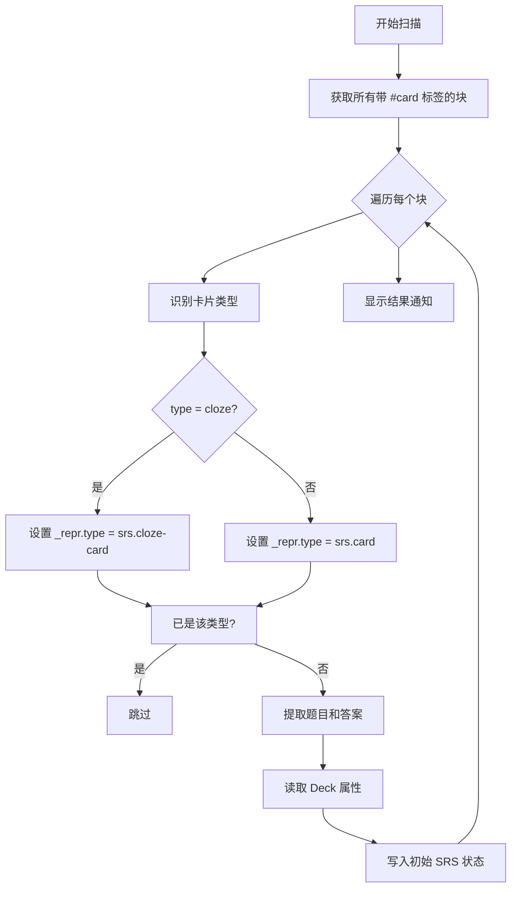

# SRS 卡片创建与管理模块

## 概述

本模块负责卡片的创建、标签识别和 Deck 分组管理，是将 Orca 块转换为 SRS 卡片的核心逻辑。

### 核心价值

- 通过 `#card` 标签自动识别卡片
- 支持 Deck 分组管理
- 提供手动和批量转换功能

## 技术实现

### 核心文件

- [main.ts](file:///d:/orca插件/虎鲸标记%20内置闪卡/src/main.ts)（卡片创建与识别函数）

### 卡片结构

```
父块（#card 标签）→ 题目
└── 第一个子块 → 答案
```

### 卡片识别规则

1. 块必须带有 `#card` 标签
2. 父块文本作为题目（front）
3. 第一个子块文本作为答案（back）
4. 从 `#card` 标签的属性中读取 Deck 名称
5. **【新增】从 `#card` 标签的 `type` 属性识别卡片类型（basic 或 cloze）**

### 核心函数

#### `scanCardsFromTags()`

批量扫描所有带 `#card` 标签的块并转换为卡片：



#### `makeCardFromBlock(cursor)`

将当前光标所在块转换为 SRS 卡片（一步到位）：

**实现逻辑**：

1. 检查块是否已有 `#card` 标签引用
2. 如无标签，使用 `core.editor.insertTag` 命令添加
   - 创建真正的标签引用和 DOM 元素
   - 利用 Orca 官方 API 确保标签正确渲染
3. 设置 `_repr.type = "srs.card"` 完成转换
4. 初始化 SRS 状态

**关键技术**：

```typescript
// 使用 Orca 官方命令添加标签
await orca.commands.invokeEditorCommand(
  "core.editor.insertTag",
  cursor,
  blockId,
  "card"
);
```

**特性**：

- ✓ 自动添加真正的 #card 标签（可交互 DOM 元素）
- ✓ 支持撤销操作
- ✓ 作为编辑器命令注册

#### `extractCardType(block): "basic" | "cloze"`

**【新增】** 从块的标签属性中提取卡片类型：

```typescript
// 标签属性结构
block.refs[].data[].name === "type"
block.refs[].data[].value // "basic" 或 "cloze"
```

**工作原理**：

1. 查找 `#card` 标签引用（`ref.type === 2 && ref.alias === "card"`）
2. 从 `ref.data` 中读取 `name === "type"` 的属性
3. 支持单选文本和多选文本两种属性类型
4. 如果值为 `"cloze"`（不区分大小写），返回 `"cloze"`
5. 其他情况默认返回 `"basic"`

**应用场景**：

- 区分填空卡（cloze）和普通卡片（basic）
- 在复习界面使用不同的渲染方式
- 使用 cloze 按钮创建填空时自动设置为 `"cloze"`

#### `extractDeckName(block): string`

从块的标签属性中提取 Deck 名称：

```typescript
// 标签属性结构
block.refs[].data[].name === "deck"
block.refs[].data[].value // Deck 名称
```

### 卡片类型管理

**【新增】** 插件支持两种卡片类型：

| 类型 | _repr.type | 标签属性 | 用途 |
|------|-----------|---------|------|
| **Basic** | `srs.card` | `type: "basic"` 或未设置 | 普通问答卡片 |
| **Cloze** | `srs.cloze-card` | `type: "cloze"` | 填空卡片 |

#### 用户操作流程

1. 在 Orca 标签页面为 `#card` 标签定义 `type` 属性（类型：单选/多选文本）
2. 添加可选值：`"basic"` 和 `"cloze"`
3. 给块打 `#card` 标签后，从下拉菜单选择类型
4. 或者使用 Cloze 按钮创建填空时自动设置为 `"cloze"`

#### 技术实现

```typescript
// 1. 识别卡片类型
const cardType = extractCardType(block)  // "basic" 或 "cloze"

// 2. 设置对应的 _repr.type
const reprType = cardType === "cloze" ? "srs.cloze-card" : "srs.card"

// 3. 更新块的 _repr
block._repr = {
  type: reprType,
  front: front,
  back: back,
  cardType: cardType  // 方便后续使用
}
```

#### 自动识别流程

- **扫描时**：`scanCardsFromTags()` 自动读取每个块的 `type` 属性
- **创建时**：`makeCardFromBlock()` 在添加标签后检查 `type` 属性
- **复习时**：复习队列同时收集 `srs.card` 和 `srs.cloze-card` 两种类型

### Deck 管理

#### 用户操作流程

1. 在 Orca 标签页面为 `#card` 标签定义 `deck` 属性
2. 添加可选值（如 "English"、"物理"、"数学"）
3. 给块打 `#card` 标签后，从下拉菜单选择 Deck

#### 默认行为

- 未设置 Deck 属性时，归入 "Default" 分组
- 支持多选类型（取第一个值）和单选类型

### 块渲染表示（\_repr）

转换后的块 `_repr` 结构：

```typescript
{
  type: "srs.card",
  front: string,  // 题目
  back: string,   // 答案
  deck: string    // Deck 名称
}
```

## 使用场景

### 1. 手动创建卡片（推荐）

1. 在块中输入题目
2. 创建子块输入答案
3. 使用斜杠命令"转换为记忆卡片"
   - 自动添加 `#card` 标签
   - 立即完成转换

### 2. 批量扫描

1. 手动为多个块添加 `#card` 标签
2. 使用命令 "SRS: 扫描带标签的卡片"
3. 自动转换所有带标签的块

## 技术要点

### 标签添加最佳实践

- **推荐方式**：使用 `core.editor.insertTag` 命令
  - 创建真正的标签引用（`block.refs`）
  - 自动渲染为可交互的 DOM 元素
  - Orca 官方支持的标准方法
- **不推荐**：直接修改 `block.text` 添加 "#card" 文本
  - 不会创建标签引用
  - 界面无法渲染为标签

## 扩展点

1. **多答案支持**：可扩展支持多个子块作为答案
2. **富文本题目**：可扩展支持图片等富媒体内容
3. **模板系统**：可扩展卡片模板功能

## 相关文件

| 文件                                                                     | 说明                |
| ------------------------------------------------------------------------ | ------------------- |
| [main.ts](file:///d:/orca插件/虎鲸标记%20内置闪卡/src/main.ts)           | 卡片创建核心函数    |
| [storage.ts](file:///d:/orca插件/虎鲸标记%20内置闪卡/src/srs/storage.ts) | 状态初始化          |
| [types.ts](file:///d:/orca插件/虎鲸标记%20内置闪卡/src/srs/types.ts)     | ReviewCard 类型定义 |
