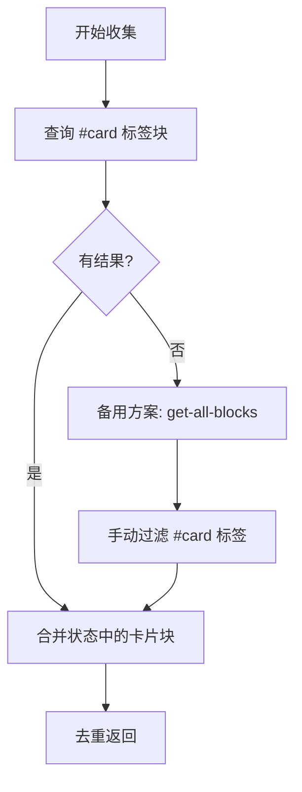
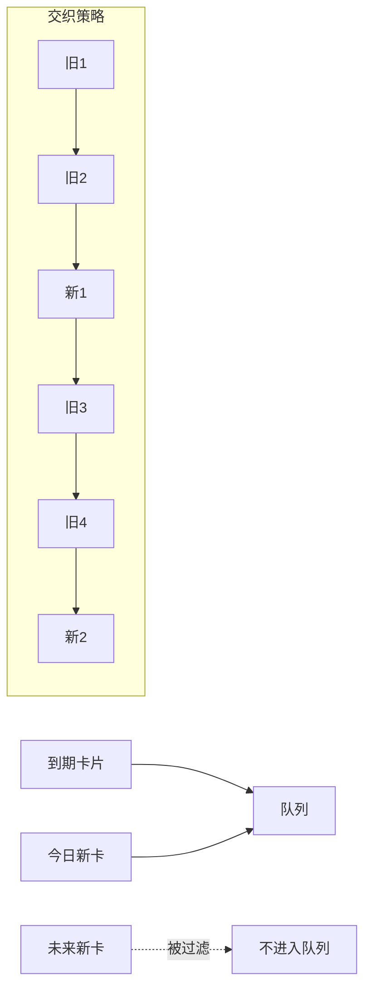
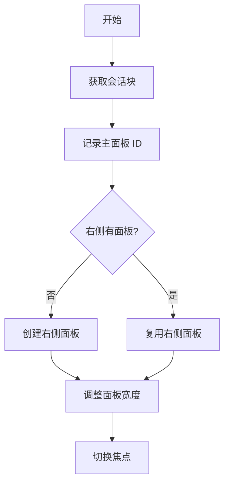

# SRS 复习队列管理模块

## 概述

本模块负责复习队列的构建和管理，包括收集待复习卡片、生成复习顺序、管理复习会话块。

### 核心价值

- 智能排序复习顺序
- 两旧一新的交织策略
- 管理复习会话的生命周期

## 技术实现

### 核心文件

- [main.ts](file:///d:/orca插件/虎鲸标记%20内置闪卡/src/main.ts)（队列管理函数）
- [reviewSessionManager.ts](file:///d:/orca插件/虎鲸标记%20内置闪卡/src/srs/reviewSessionManager.ts)（会话块管理）

### 核心函数

#### `collectSrsBlocks(): Promise<BlockWithRepr[]>`

收集所有 SRS 卡片块：



#### `collectReviewCards(): Promise<ReviewCard[]>`

将块转换为 ReviewCard 对象：

```typescript
// 返回结构
{
  id: DbId,       // 块 ID
  front: string,  // 题目
  back: string,   // 答案
  srs: SrsState,  // SRS 状态
  isNew: boolean, // 是否新卡
  deck: string    // Deck 名称
}
```

#### `buildReviewQueue(cards): ReviewCard[]`

构建复习队列，采用两旧一新策略。

**关键特性（2025-12-10 更新）：**

- **新卡到期检查**：新卡也需要检查到期时间，只有到期日期 <= 今天的新卡才会出现在队列中
- **日期比较方式**：只比较日期（零点），忽略具体时分秒
- **支持分天推送**：实现 Cloze 卡片的 c1 今天、c2 明天、c3 后天的分天推送机制

```typescript
// 到期卡片：已复习过 && 到期日期 < 明天零点
const dueCards = cards.filter(card => {
  if (card.isNew) return false
  return card.srs.due.getTime() < todayEnd.getTime()
})

// 新卡片：未复习过 && 到期日期 < 明天零点（关键修改）
const newCards = cards.filter(card => {
  if (!card.isNew) return false
  return card.srs.due.getTime() < todayEnd.getTime()
})
```



#### `calculateDeckStats(cards): DeckStats`

计算各 Deck 的统计信息：

```typescript
// 返回结构
{
  decks: DeckInfo[],   // 各 Deck 信息
  totalCards: number,  // 总卡片数
  totalNew: number,    // 总新卡数
  totalOverdue: number // 总到期数
}
```

### 会话块管理

#### `getOrCreateReviewSessionBlock(pluginName): Promise<DbId>`

获取或创建复习会话块：

1. 检查内存中是否已有会话块
2. 检查插件数据存储
3. 创建新会话块

#### `cleanupReviewSessionBlock(pluginName): Promise<void>`

清理复习会话块记录：

- 重置内存中的块 ID
- 清除插件数据存储

### 复习队列策略

#### 两旧一新交织

```
输入：
- 到期卡片：[A, B, C, D, E]
- 新卡片：[1, 2, 3]

输出队列：
[A, B, 1, C, D, 2, E, 3]
```

#### 到期判定（2025-12-10 更新）

- **新卡定义**：`lastReviewed === null` 或 `reps === 0`
- **到期判断（类似 ANKI）**：
  - 只比较日期，忽略时分秒
  - 计算今天范围：`[今天零点, 明天零点)`
  - 到期条件：`card.srs.due < 明天零点`
  - 即使卡片到期时间是今天 14:10，在今天 14:00 也能看到
- **新卡也要检查到期**：只有到期日期 <= 今天的新卡才会出现在队列中
- **未来卡片**：到期日期 > 今天的卡片不进入本次队列

### 面板管理

#### `startReviewSession(deckName?)`

启动复习会话：

1. 获取/创建复习会话块
2. 记录当前面板为主面板
3. 在右侧创建复习面板
4. 调整面板宽度比例



## 辅助函数

| 函数                       | 说明                  |
| -------------------------- | --------------------- |
| `isSrsCardBlock(block)`    | 判断是否为 SRS 卡片块 |
| `getFirstChildText(block)` | 获取第一个子块文本    |
| `resolveFrontBack(block)`  | 解析题目和答案        |
| `removeHashTags(text)`     | 移除文本中的 # 标签   |
| `extractDeckName(block)`   | 提取 Deck 名称        |

## 扩展点

1. **筛选策略**：可扩展按 Deck、标签筛选
2. **优先级算法**：可扩展更复杂的排序算法
3. **学习限制**：可扩展每日新卡/复习卡上限

## 相关文件

| 文件                                                                                               | 说明            |
| -------------------------------------------------------------------------------------------------- | --------------- |
| [main.ts](file:///d:/orca插件/虎鲸标记%20内置闪卡/src/main.ts)                                     | 队列管理函数    |
| [reviewSessionManager.ts](file:///d:/orca插件/虎鲸标记%20内置闪卡/src/srs/reviewSessionManager.ts) | 会话块管理      |
| [types.ts](file:///d:/orca插件/虎鲸标记%20内置闪卡/src/srs/types.ts)                               | ReviewCard 类型 |
