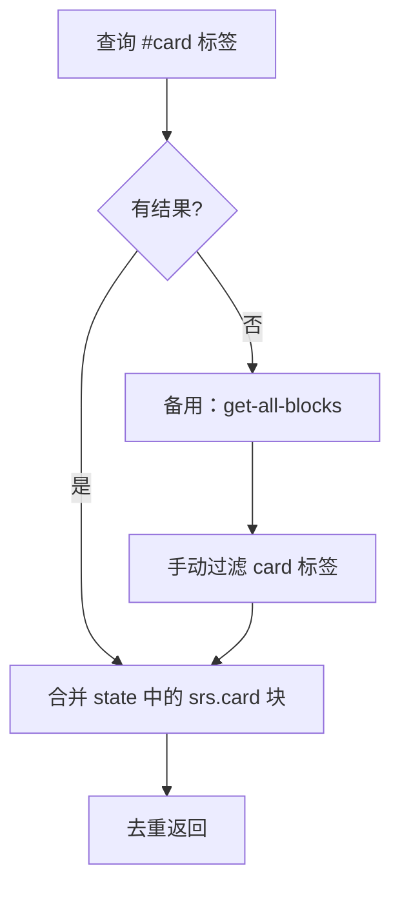
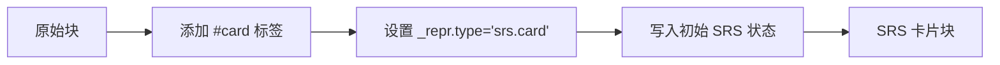

# SRS 工具函数模块文档

本文档涵盖 2025-12-09 重构后新增的 6 个工具模块。

## 模块概览

| 模块       | 文件路径                   | 职责                      |
| ---------- | -------------------------- | ------------------------- |
| 面板工具   | `src/srs/panelUtils.ts`    | 查找/调整 Orca 编辑器面板 |
| 块工具     | `src/srs/blockUtils.ts`    | 块类型判断、文本提取      |
| 卡片收集   | `src/srs/cardCollector.ts` | 收集 SRS 块、构建复习队列 |
| Deck 工具  | `src/srs/deckUtils.ts`     | 提取 deck 名称、统计信息  |
| 卡片创建   | `src/srs/cardCreator.ts`   | 将块转换为卡片、批量扫描  |
| 浏览器管理 | `src/srs/cardBrowser.ts`   | 打开/关闭卡片浏览器弹窗   |

---

## panelUtils.ts

**职责**：Orca 编辑器面板操作

### 导出函数

| 函数                                           | 说明                       |
| ---------------------------------------------- | -------------------------- |
| `findRightPanel(node, currentPanelId)`         | 查找当前面板右侧的面板     |
| `containsPanel(node, panelId)`                 | 检查面板树是否包含指定面板 |
| `extractPanelId(node)`                         | 提取面板树中第一个面板 ID  |
| `schedulePanelResize(basePanelId, pluginName)` | 延迟调整面板尺寸           |

---

## blockUtils.ts

**职责**：块处理工具

### 导出类型

```typescript
type BlockWithRepr = Block & { _repr?: Repr };
```

### 导出函数

| 函数                       | 说明                  |
| -------------------------- | --------------------- |
| `removeHashTags(text)`     | 移除文本中的 #标签    |
| `isSrsCardBlock(block)`    | 判断块是否为 SRS 卡片 |
| `getFirstChildText(block)` | 获取首个子块文本      |
| `resolveFrontBack(block)`  | 解析卡片正反面内容    |

---

## cardCollector.ts

**职责**：卡片收集和队列构建

### 导出函数

| 函数                              | 说明              |
| --------------------------------- | ----------------- |
| `collectSrsBlocks(pluginName?)`   | 收集所有 SRS 块   |
| `collectReviewCards(pluginName?)` | 收集待复习卡片    |
| `buildReviewQueue(cards)`         | 构建 2:1 交错队列 |

### 收集逻辑



---

## deckUtils.ts

**职责**：Deck 管理

### 导出函数

| 函数                        | 说明                     |
| --------------------------- | ------------------------ |
| `extractDeckName(block)`    | 从标签属性提取 deck 名称 |
| `calculateDeckStats(cards)` | 计算各 deck 统计信息     |

### extractDeckName 逻辑

1. 查找 `block.refs` 中 `type=2, alias="card"` 的引用
2. 从 `ref.data` 找 `name="deck"` 的属性
3. 返回 `value`（支持数组或字符串），默认 `"Default"`

---

## cardCreator.ts

**职责**：卡片创建和扫描

### 导出函数

| 函数                                    | 说明                        |
| --------------------------------------- | --------------------------- |
| `scanCardsFromTags(pluginName)`         | 批量扫描 #card 标签块并转换 |
| `makeCardFromBlock(cursor, pluginName)` | 将光标所在块转换为卡片      |

### 转换流程



---

## cardBrowser.ts

**职责**：卡片浏览器弹窗管理

### 导出函数

| 函数                           | 说明           |
| ------------------------------ | -------------- |
| `openCardBrowser(pluginName)`  | 打开浏览器弹窗 |
| `closeCardBrowser(pluginName)` | 关闭浏览器弹窗 |

### 实现细节

- 使用 React 18 `createRoot` API
- 创建 DOM 容器并挂载 `SrsCardBrowser` 组件
- 关闭时卸载组件并移除容器

---

## 相关文件

| 文件                                                                                 | 说明       |
| ------------------------------------------------------------------------------------ | ---------- |
| [panelUtils.ts](file:///d:/orca插件/虎鲸标记%20内置闪卡/src/srs/panelUtils.ts)       | 面板工具   |
| [blockUtils.ts](file:///d:/orca插件/虎鲸标记%20内置闪卡/src/srs/blockUtils.ts)       | 块工具     |
| [cardCollector.ts](file:///d:/orca插件/虎鲸标记%20内置闪卡/src/srs/cardCollector.ts) | 卡片收集   |
| [deckUtils.ts](file:///d:/orca插件/虎鲸标记%20内置闪卡/src/srs/deckUtils.ts)         | Deck 工具  |
| [cardCreator.ts](file:///d:/orca插件/虎鲸标记%20内置闪卡/src/srs/cardCreator.ts)     | 卡片创建   |
| [cardBrowser.ts](file:///d:/orca插件/虎鲸标记%20内置闪卡/src/srs/cardBrowser.ts)     | 浏览器管理 |
